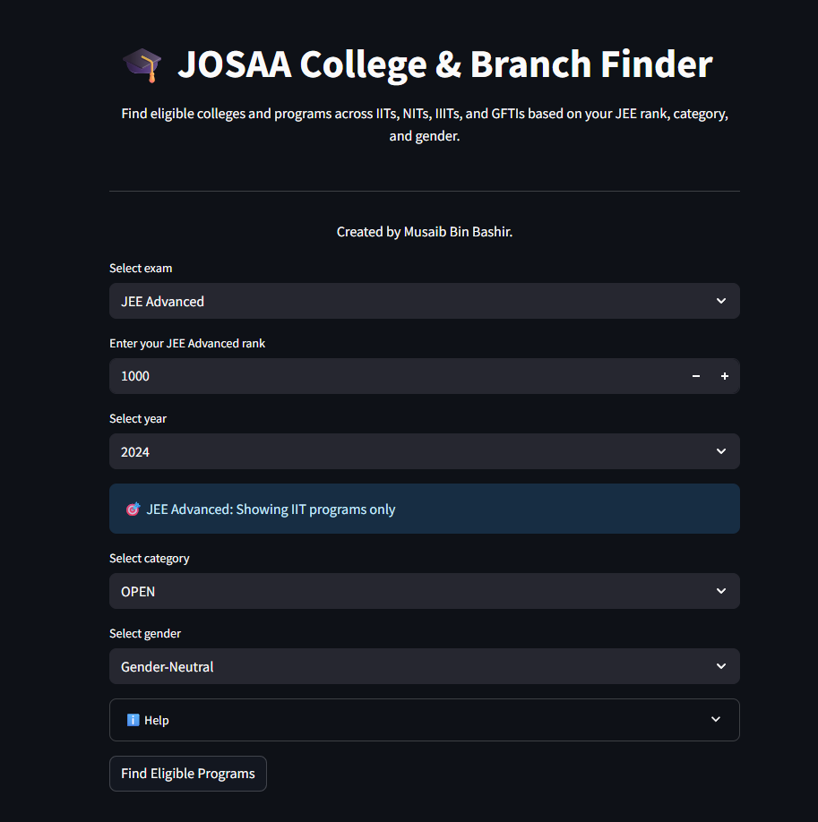
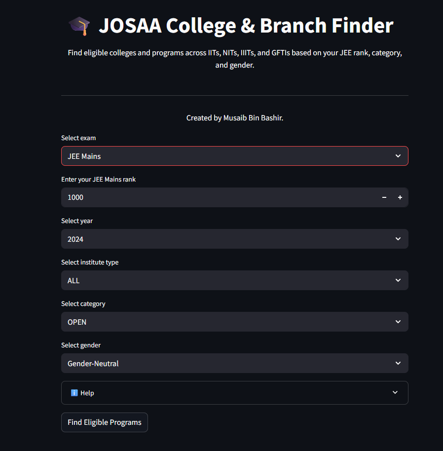
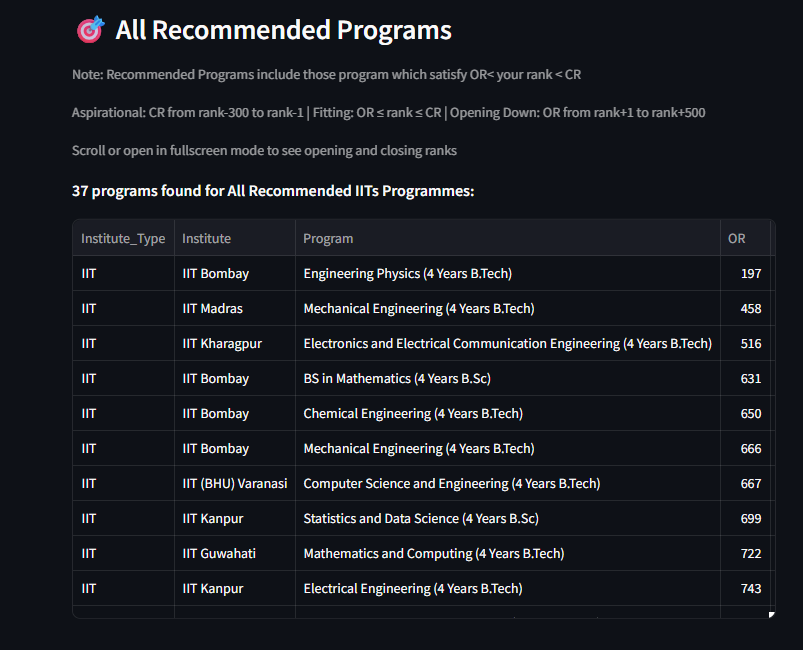
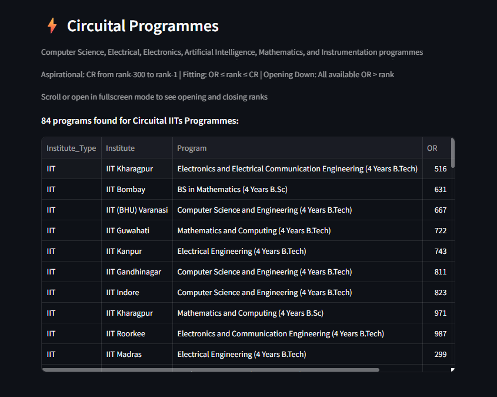
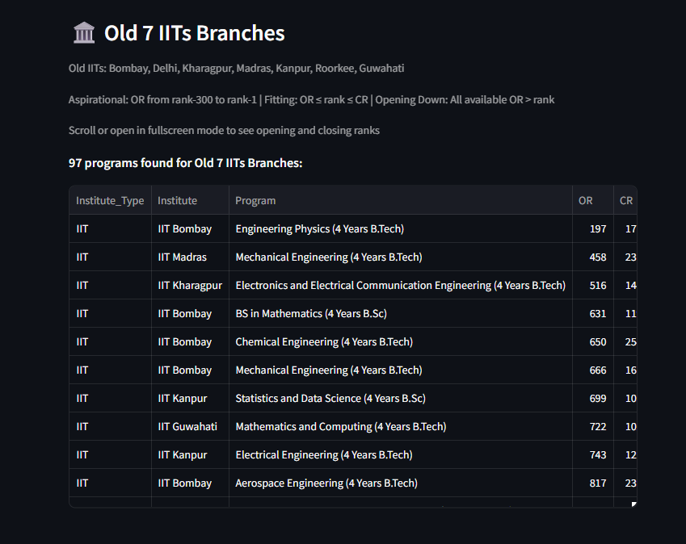

# 🎓 JOSAA College & Branch Finder
[Visit the site- JOSAA-Ranks](https://josaa-ranks.streamlit.app/)

A comprehensive Streamlit web application to help JEE candidates find eligible colleges and engineering programs across IITs, NITs, IIITs, and GFTIs based on their rank, category, and preferences with data taken from official JOSAA website.

## ✨ Features

- **Multi-Exam Support**: Works with both JEE Advanced (IITs) and JEE Mains (NITs, IIITs, GFTIs)
- **Comprehensive Institution Coverage**: 
  - IITs (Indian Institutes of Technology)
  - NITs (National Institutes of Technology)
  - IIITs (Indian Institutes of Information Technology)
  - GFTIs (Government Funded Technical Institutions)
- **Multiple Category Support**: OPEN, EWS, OBC-NCL, SC, ST, and PWD (including OPEN(PWD), SC(PWD), etc.)
- **Gender-Based Filtering**: Gender-Neutral and Female-only seats
- **Smart Program Recommendations**: 
  - **Fitting**: Programs where your rank falls within OR ≤ rank ≤ CR
  - **Aspirational**: Programs where CR is close to your rank (within 300 ranks)
  - **Opening Down**: Programs where OR is slightly above your rank
- **Specialized Filtering**:
  - Circuital programs (CS, EE, ECE, AI, Data Science, etc.)
  - Old 7 IITs (for JEE Advanced)
- **Multi-Year Data**: Supports 2022, 2023, and 2024 admission data

## 🎯 How to Use

1. **Select Exam Type**: Choose between JEE Advanced (for IITs) or JEE Mains (for NITs, IIITs, GFTIs)

2. **Enter Your Rank**: Input your JEE rank

3. **Select Year**: Choose the admission year data (2022, 2023, or 2024)

4. **Choose Institute Type** (for JEE Mains):
   - ALL: Shows combined results from NITs, IIITs, and GFTIs
   - NITs: National Institutes of Technology only
   - IIITs: Indian Institutes of Information Technology only
   - GFTIs: Government Funded Technical Institutions only

5. **Select Category**: 
   - OPEN, EWS, OBC-NCL, SC, ST: Standard categories
   - PWD: Persons with Disabilities (includes all PWD variants)

6. **Choose Gender**: Gender-Neutral or Female-only seats

7. **Click "Find Eligible Programs"** to get your results

## 📈 Understanding Results

### Status Categories:
- **🎯 Fitting**: OR ≤ Your Rank ≤ CR (High chance of admission)
- **⚡ Aspirational**: CR is within 300 ranks below your rank (Moderate chance)
- **📈 Opening Down**: OR is above your rank but within 500 ranks (Lower chance, but worth considering)

### Result Sections:
1. **All Recommended Programs**: Complete list of eligible programs
2. **Circuital Programs**: CS, EE, ECE, AI, Data Science, and related branches
3. **Old 7 IITs** (JEE Advanced only): Programs from the original 7 IITs

## 🔧 Features

### Smart Filtering
- Automatically handles data cleaning and numeric conversion
- Filters out invalid or incomplete data
- Provides detailed error messages for troubleshooting

### Interactive Tables
- Sortable columns (double-click headers)
- Downloadable results
- Fullscreen viewing option
- Status-based color coding

## 🛠️ Technical Details

### Built With:
- **Streamlit**: Web application framework
- **Pandas**: Data manipulation and analysis
- **NumPy**: Numerical computing

## 🤝 Contributing

1. Fork the repository
2. Create your feature branch (`git checkout -b feature/NewFeature`)
3. Commit your changes (`git commit -m 'Add some NewFeature'`)
4. Push to the branch (`git push origin feature/NewFeature`)
5. Open a Pull Request

## 📄 License

This project is licensed under the MIT License - see the [LICENSE](LICENSE) file for details.

## 👨‍💻 Author

**Musaib Bin Bashir**

**Happy College Hunting! 🎯**
